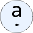
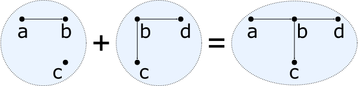
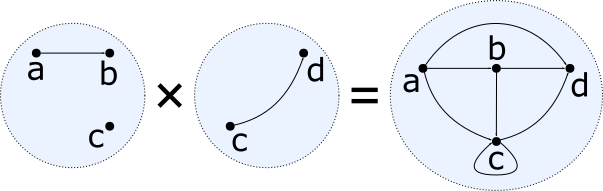

<div style="text-align: right;"></div>

# Algebraic Graphs
<!-- .element: style="font-size: 2.9em;margin-top: 50px;" -->

---

#### Andrey Mokhov

<small>GitHub: [@snowleopard](https://github.com/snowleopard),
Twitter: [@andreymokhov](https://twitter.com/andreymokhov),
math &amp; programming [blog](https://blogs.ncl.ac.uk/andreymokhov/)</small>

----
<!-- .slide: data-background="img/search.png" -->

## Not [this](https://www.google.co.uk/search?q=algebraic+graphs&tbm=isch) kind of graphs!
<!-- .element: class="fragment" style="background: #fdeada; border: solid 1px; box-shadow: 15px 15px 20px rgba(0, 0, 0, 0.4); line-height: 120px; font-size: 1.7em; margin-top: 250px;" -->

----
## This kind of graphs


* Directed or undirected edges
* Labelled vertices, labelled or unlabelled edges
* Cycles and self-loops are allowed
* No vertex ports, no forbidden edges

----
<!-- .slide: style="text-align: left;" -->
## From math to Haskell
<!-- .element: style="text-align: center;" -->

A **graph** is typically represented by a pair `$(V, E)$`:
* `$V$` is a set of **vertices**
* `$E \subseteq V \times V$` is a set of **edges**
* Example: `$(\{1,2,3\}, \{(1,2), (1,3)\})$`


A direct translation to Haskell is:
<!-- .element: class="fragment" data-fragment-index="1" style="margin-top: 50px;" -->
```haskell
type Graph a = (Set a, Set (a,a))

example :: Graph Int
example = ([1,2,3], [(1,2), (1,3)])
```
<!-- .element: class="fragment" data-fragment-index="1" -->

----
<!-- .slide: style="text-align: left;" -->
## Problem
<!-- .element: style="text-align: center;" -->

A **graph** is typically represented by a pair `$(V, E)$`:
* `$V$` is a set of **vertices**
* `$E \subseteq V \times V$` is a set of **edges**
* Non-example: `$(\{1\}, \{(1,\color{red}{2})\})$`


```haskell
type Graph a = (Set a, Set (a,a))

nonExample :: Graph Int
nonExample = ([1], [(1,2)]) -- This happily compiles...
```
<!-- .element: style="margin-top: 50px;" -->

Let's make illegal states unrepresentable!
<!-- .element: class="fragment" -->

----
## Algebraic graphs

```haskell
data Graph a = Empty
             | Vertex a
             | Overlay (Graph a) (Graph a)
             | Connect (Graph a) (Graph a)
```
<!-- .element: style="margin-top: 40px;" -->

<div style="text-align: left; font-size: 0.85em; border: solid 1px; background: #ebf1de; padding: 10px; margin-top: 15px;">
Every graph can be represented by a **Graph** expression.
Non-graphs cannot be represented.
</div>

<div style="text-align: left; font-size: 0.85em; margin-top: 60px;">
A. Mokhov: [Algebraic Graphs with Class (Functional Pearl)](https://github.com/snowleopard/alga-paper). Haskell Symposium, 2017.
</div>

--
### `Empty :: Graph a`
<!-- .element: style="margin-bottom: 460px;" -->

`$$(\varnothing, \varnothing)$$`
<!-- .element: class="fragment" -->

--
### `Vertex :: a -> Graph a`



`$$(\{a\}, \varnothing)$$`

--
### `Overlay :: Graph a -> Graph a -> Graph a`
<!-- .element: style="font-size: 1.0em;" -->



`$$(V_1, E_1) + (V_2, E_2) = (V_1 \cup V_2, E_1 \cup E_2)$$`

--
### `Connect :: Graph a -> Graph a -> Graph a`
<!-- .element: style="font-size: 1.0em;" -->



`$$(V_1, E_1) \times (V_2, E_2) = (V_1 \cup V_2, E_1 \cup E_2 \cup V_1 \times V_2)$$`

----
## Algebraic graphs

A small domain-specific language (DSL) for describing graphs:
<!-- .element: style="text-align: left; font-size: 0.8em; margin-top: 40px; margin-bottom: 10px;" -->

```haskell
data Graph a = Empty
             | Vertex a
             | Overlay (Graph a) (Graph a)
             | Connect (Graph a) (Graph a)
```

Directed graph semantics:
<!-- .element: style="text-align: left; font-size: 0.8em; margin-top: 30px; margin-bottom: 10px;" -->
<div style="font-size: 0.75em;">
<ul style="line-height: 160%;">
<li>**Empty** is the empty graph `$(\varnothing, \varnothing)$`</li>
<li>**Vertex** creates a singleton graph `$(\{a\}, \varnothing)$`</li>
<li>**Overlay** of `$(V_1, E_1)$` and `$(V_2, E_2)$` is `$(V_1 \cup V_2, E_1 \cup E_2)$`</li>
<li>**Connect** of `$(V_1, E_1)$` and `$(V_2, E_2)$` is `$(V_1 \cup V_2, E_1 \cup E_2 \cup V_1 \times V_2)$`</li>
</ul></div>