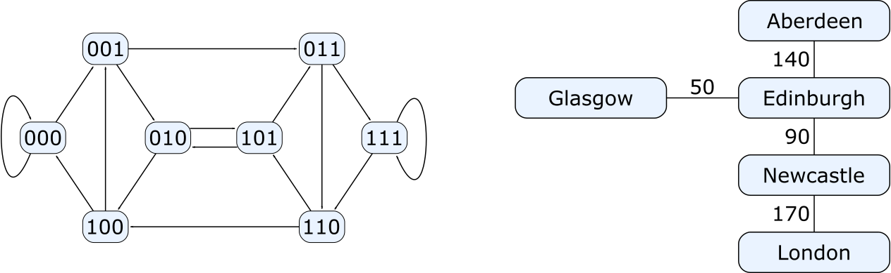

<div style="text-align: right;"></div>

# Algebraic Graphs
<!-- .element: style="font-size: 2.9em;margin-top: 50px;" -->

---

#### Andrey Mokhov

<small>GitHub: [@snowleopard](https://github.com/snowleopard),
Twitter: [@andreymokhov](https://twitter.com/andreymokhov),
math &amp; programming [blog](https://blogs.ncl.ac.uk/andreymokhov/)</small>

----
<!-- .slide: data-background="img/search.png" -->

## Not this kind of graphs!
<!-- .element: class="fragment" style="background: #fdeada; border: solid; box-shadow: 15px 15px 20px rgba(0, 0, 0, 0.4); line-height: 120px; font-size: 1.7em; margin-top: 250px;" -->

----
## This kind of graphs



* Directed or undirected edges
* Labelled vertices, labelled or unlabelled edges
* Cycles and self-loops are allowed
* No vertex ports, no forbidden edges

----
<!-- .slide: style="text-align: left;" -->
## From math to Haskell
<!-- .element: style="text-align: center;" -->

A **graph** is typically represented by a pair `$(V, E)$`:
* `$V$` is a set of **vertices**
* `$E \subseteq V \times V$` is a set of **edges**
* Example: `$(\{1,2,3\}, \{(1,2), (1,3)\})$`


A direct translation to Haskell is:
<!-- .element: class="fragment" data-fragment-index="1" style="margin-top: 50px;" -->
```
type Graph a = (Set a, Set (a,a))

example :: Graph Int
example = ([1,2,3], [(1,2), (1,3)])
```
<!-- .element: class="fragment" data-fragment-index="1" -->